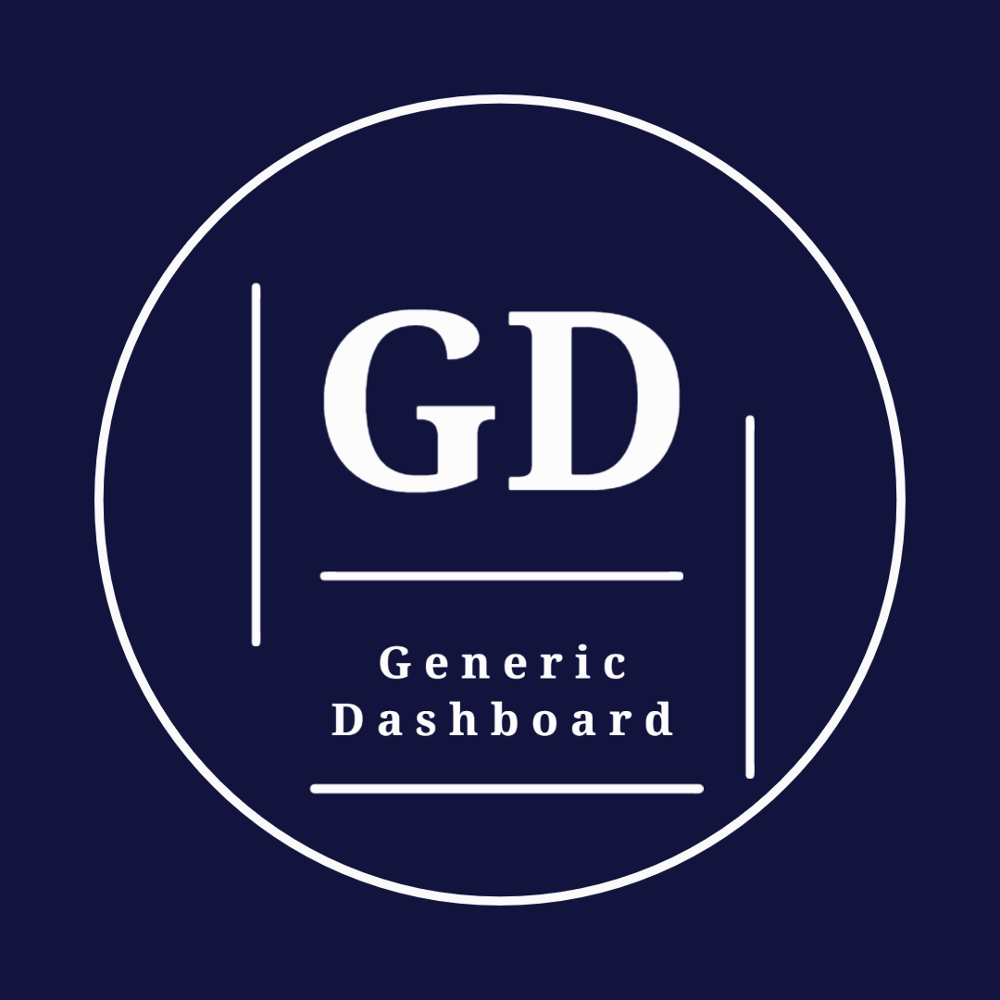

<p><a href="https://github.com/luis-saes/portfolio-dashboard">EN</a> | PT
</p>

<br />
<div align="center">
  

  <h2 align="center">Dashboard Genérica</h2>

  <p align="center">
    Apenas uma Dashboard Genérica
  </p>
  <br />
</div>

## Sobre o projeto

Esta Dashboard foi criada com o propósito de obter conhecimento em diferentes habilidades de desenvolvimento web. Você pode consultar o design por meio do link: https://www.figma.com/file/WFyRPMM0S1pHvFf4vN5vl6/Generic-Dashboard
### Construído com

* [![React][React.js]][React-url]
* [![Express][Express.js]][Express-url]
* [![TypeScript][TypeScript]][TypeScript-url]
* [![Bootstrap][Bootstrap.com]][Bootstrap-url]

## Instalação

Para obter uma cópia do código da dashboard em sua máquina, clone o repositório com o seguinte comando:
```sh
$ git clone https://github.com/luis-saes/portfolio-dashboard.git
```

## Como contribuir

1. Escolha uma issue do repositório e deixe um comentário expressando interesse em resolvê-la.
2. Instale o projeto em sua máquina
3. Faça um fork do repositório, crie uma nova branch e desenvolva o trabalho solicitado na issue, utilizando o arquivo correto para efetuar as modificações, como especificado na issue escolhida.
4. Quando o trabalho estiver finalizado, envie um Pull Request cujo corpo da mensagem deve obedecer o seguinte modelo:

```
Descrição: Forneça uma breve descrição do trabalho feito.
<LINHA EM BRANCO>
Fixes #<NÚMERO DA ISSUE QUE FOI RESOLVIDA>
```

## Começando

Em progresso

### Pré-requisitos

Node na versão 16.16.0 ou superior.
NPM na versão 8.13.2 ou superior.

# Uso

1. Instale o projeto em sua máquina.
2. Execute o front-end do React acessando a pasta `/front-end` e executando o comando `npm start` no terminal.
3. Acesse `localhost:3000/login` para a tela de login e `localhost:3000/dashboard` para a tela da dashboard.

# Roteiro

- [x] Projetar páginas da dashboard com o Figma
- [x] Criar uma estrutura de front-end com React
- [x] Criar uma estrutura de back-end com Express
- [x] Criar uma estrutura de banco de dados com SQLite
- [x] Desenvolver placeholders do front-end
- [x] Projetar tabelas SQLite
- [x] Criar e popular tabelas SQLite
- [ ] Criar o MVC do back-end
- [ ] Integrar front-end com dados do back-end
- [ ] Criar autenticação de login
- [ ] Distribuir a aplicação

## Licença

Distribuído sobre a Licença MIT. Veja `LICENSE.txt` para mais informações.

## Contato

Luis Henrique Saes Scandelai - saeslhs@gmail.com

Link do projeto: [https://github.com/luis-saes/portfolio-dashboard](https://github.com/luis-saes/portfolio-dashboard)

<!-- MARKDOWN LINKS & IMAGES -->
[license-shield]: https://img.shields.io/github/license/othneildrew/Best-README-Template.svg?style=for-the-badge
[license-url]: https://github.com/othneildrew/Best-README-Template/blob/master/LICENSE.txt
[linkedin-shield]: https://img.shields.io/badge/-LinkedIn-black.svg?style=for-the-badge&logo=linkedin&colorB=555
[linkedin-url]: https://linkedin.com/in/othneildrew
[product-screenshot]: images/screenshot.png
[React.js]: https://img.shields.io/badge/React-20232A?style=for-the-badge&logo=react&logoColor=61DAFB
[React-url]: https://reactjs.org/
[Bootstrap.com]: https://img.shields.io/badge/Bootstrap-563D7C?style=for-the-badge&logo=bootstrap&logoColor=white
[Bootstrap-url]: https://getbootstrap.com
[Express.js]: https://img.shields.io/badge/Express.js-404D59?style=for-the-badge
[Express-url]: https://expressjs.com/
[TypeScript]: https://img.shields.io/badge/TypeScript-007ACC?style=for-the-badge&logo=typescript&logoColor=white
[TypeScript-url]: https://www.typescriptlang.org/
