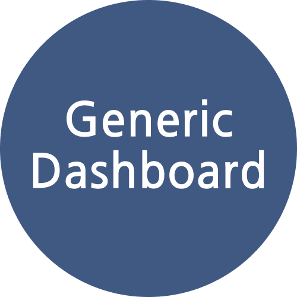

<p>EN | 
  <a href="https://github.com/luis-saes/portfolio-dashboard/blob/main/README-pt-BR.md">PT</a>
</p>

<br />
<div align="center">
  

  <h2 align="center">Generic Dashboard</h2>

  <p align="center">
    Just a Generic Dashboard
  </p>
  <br />
</div>

## About The Project

This Dashboard was created with the purpose of getting knowledge in different web development abilities. 
You can check the design through the link: https://www.figma.com/file/WFyRPMM0S1pHvFf4vN5vl6/Generic-Dashboard

### Built With

* [![React][React.js]][React-url]
* [![Express][Express.js]][Express-url]
* [![TypeScript][TypeScript]][TypeScript-url]
* [![Bootstrap][Bootstrap.com]][Bootstrap-url]

## Installation

To get a copy of the dashboard code on your machine, just clone the repository with the following command:
```sh
$ git clone https://github.com/luis-saes/portfolio-dashboard.git
```

## How to Contribute

1. Choose an issue from the repository and leave a comment showing interest in solving it.
2. Install the project on your machine
3. Fork the repository, create a new branch and develop the work requested in the issue, utilizing the correct file to make the changes, as specified in the chosen issue
4. When the work is finished, submit a Pull Request whose message body must comply with the following template:

```
Description: Provide a brief description of the work performed.
<BLANK LINE>
Fixes #<ISSUE NUMBER THAT WAS SOLVED>
```

## Getting Started

WIP

### Prerequisites

Node version 16.16.0 or later.
NPM version 8.13.2 or later.

# Usage

1. Install the project on your machine.
2. Run the React front-end by accessing the folder `/front-end` and running the terminal command `npm start`.
3. Access `localhost:3000/login` for the login screen and `localhost:3000/dashboard` for the dashboard screen.

# Roadmap

- [x] Design dashboard pages with Figma
- [x] Create React front-end structure
- [x] Create Express back-end structure
- [x] Create SQLite database structure
- [x] Develop front-end placeholders
- [x] Design SQLite tables
- [x] Create and populate SQLite tables
- [ ] Create backend MVC
- [ ] Integrate front-end with back-end data
- [ ] Create login authentication
- [ ] Deploy application

## License

Distributed under the MIT License. See `LICENSE.txt` for more information.

## Contact

Luis Henrique Saes Scandelai - saeslhs@gmail.com

Project Link: [https://github.com/luis-saes/portfolio-dashboard](https://github.com/luis-saes/portfolio-dashboard)

<!-- MARKDOWN LINKS & IMAGES -->
[license-shield]: https://img.shields.io/github/license/othneildrew/Best-README-Template.svg?style=for-the-badge
[license-url]: https://github.com/othneildrew/Best-README-Template/blob/master/LICENSE.txt
[linkedin-shield]: https://img.shields.io/badge/-LinkedIn-black.svg?style=for-the-badge&logo=linkedin&colorB=555
[linkedin-url]: https://linkedin.com/in/othneildrew
[product-screenshot]: images/screenshot.png
[React.js]: https://img.shields.io/badge/React-20232A?style=for-the-badge&logo=react&logoColor=61DAFB
[React-url]: https://reactjs.org/
[Bootstrap.com]: https://img.shields.io/badge/Bootstrap-563D7C?style=for-the-badge&logo=bootstrap&logoColor=white
[Bootstrap-url]: https://getbootstrap.com
[Express.js]: https://img.shields.io/badge/Express.js-404D59?style=for-the-badge
[Express-url]: https://expressjs.com/
[TypeScript]: https://img.shields.io/badge/TypeScript-007ACC?style=for-the-badge&logo=typescript&logoColor=white
[TypeScript-url]: https://www.typescriptlang.org/
